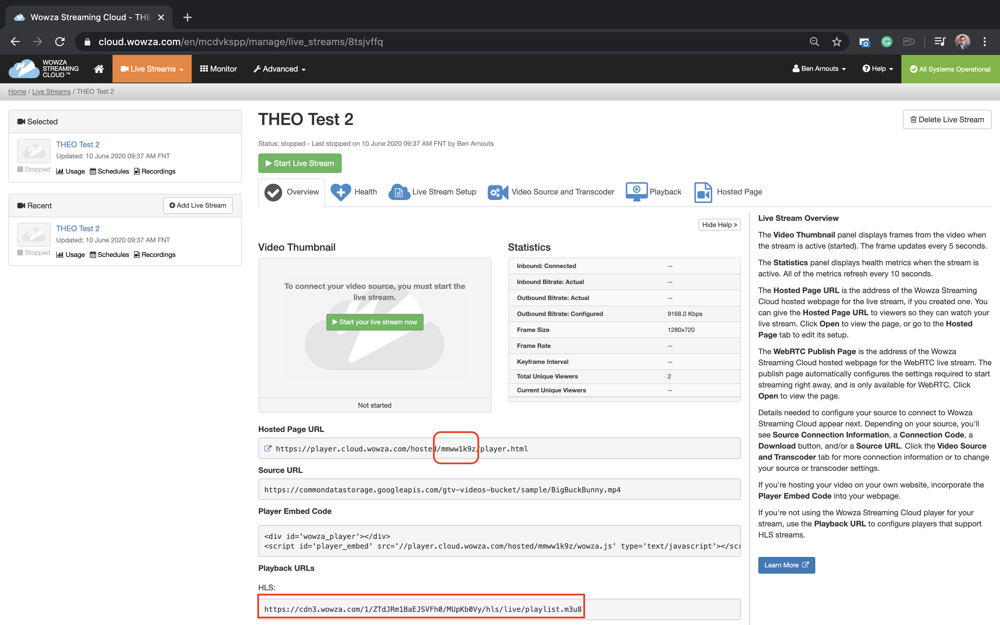

# THEOplayer Wowza
Wowza and THEOplayer are partners in the streaming industry. When developers use both products,
* Wowza Streaming Cloud is used on the back-end to manage live streams.
* THEOplayer is used on the client-side to playout the live streams.

Cross-product documentation resources:
* https://www.wowza.com/blog/wowza-streaming-cloud-getting-started
* https://www.theoplayer.com/blog/theoplayer-joins-wowza-media-systems-technology-alliance-partner-program

This reference app demonstrates an integration between THEOplayer and Wowza Streaming Cloud.
 * You can use this project as a starting template for Wowza and THEOplayer playback.
 * You can leverage the `theoplayer-wowza.js` JavaScript library. **This is completely optional.**
 This JavaScript file exposes an API which automatically unlocks a number of features which bridge THEOplayer and Wowza functionalities.

Head over to https://www.wowza.com/blog/wowza-streaming-cloud-getting-started for an introduction to Wowza Streaming Cloud and THEOplayer.

# Features of `theoplayer-wowza.js`
## Livestream information retrieval
When setting a stream, you can supply a Wowza configuration which will be intercepted and processed by `theoplayer-wowza.js`.
If this configuration contains the `jsonUrl`, then the JSON response will automatically be fetched and exposed.
 // image
Furthermore,
* THEOplayer overlays the title when the video is paused.
* THEOplayer sets the poster image if no prior poster has been configured.
* THEOplayer leverages this information to enhance the offline-to-online-to-offline transitions. (See below.) 

## Enhanced offline-to-online-to-offline transitions
The main use-case of Wowza Streaming Cloud is to stream live video.

<details>
  <summary>The lifecycle of Wowza Streaming Cloud</summary>
  
  1. Add Live Stream (START)
     2. Start Live Stream
        3. Stop Live Stream
           5. Start Live Stream (go back to 1.i.)
           6. Delete Live Stream (END)
        4. Reset Live Stream
           7. Stop Live Stream (go back to 1.i.a.) 
           8. Reset Live Stream (go back to 1.i.b.)
           
  In this lifecycle, the following statements are true:
  * When you add your live stream, your stream is offline.
  * Before you start your live stream, your stream remains offline.
  * When you start your live stream, your stream goes online.
  * When you stop your live stream, your stream goes offline.
  * When you (re)start your livestream, your stream goes online.
</details>

When you supply a Wowza configuration, the following functionalities are unlocked:
* When your live stream is still offline, then THEOplayer displays a placeholder which overlaps the video player.
* When your live stream becomes available, then THEOplayer automatically starts playing the stream.
* When your live stream stops, then THEOplayer displays a placeholder which overlaps the video player.
* When your live stream restarsm then THEOplayer automatically starts playing the stream.


What's shown inside of the placeholder?
* A) A single, configurable status message.
* B) A poster image, title and countdown clock -- if the `jsonUrl` is provided.

# Getting started

## 1. THEOplayer HTML5 SDK
Create a THEOplayer HTML5 SDK at https://portal.theoplayer.com/. Get familiar with the THEOplayer API at https://docs.portal.theoplayer.com/getting-started/01-sdks/01-web/00-getting-started.md.

## 2. Create a Wowza live stream
Login to your Wowza account and configure a livestream.

After configuring your livestream, you'll have access to your HLS live stream and your public stream ID.




In the screenshot above, `https://cdn3.wowza.com/1/ZTdJRm1BaEJSVFh0/MUpKb0Vy/hls/live/playlist.m3u8
` is the URL of the HLS live stream, and `mmww1k9z` is your public stream ID.
You can create your public JSON URL by entering the stream ID in the following template: `https://player.cloud.wowza.com/hosted/<stream ID>/wowza.json`.

## 3. Configure local demo
First of all, you must run the NPM scripts described below to install your NPM dependencies and to compile the 
previously mentioned `theoplayer-wowza.js`. Finally, you can run an NPM script to boot a local web server.

Once you have all of your library files, you want to swap in your THEOplayer library files in `public/index.html`.
(Head over to the [getting started guide](https://docs.portal.theoplayer.com/getting-started/01-sdks/01-web/00-getting-started.md) if you're unsure on how to achieve this.)

Then, you want to configure your Wowza stream and Wowza configuration in `public/index.html`.
Go through the API for more information on the Wowza configuration.

The recording at https://youtu.be/JsJcUteaEiw runs through the second and third step.

# Live Demo
A live demo is available at https://cdn.theoplayer.com/demos/wowza/github-reference-app/index.html.

# API of `theoplayer-wowza.js`

`THEOplayerWowza`: the global variable which exposes a function to register a video player.
```javascript
var wowzaSession = theoplayerWowza.registerPlayer(player);
```
The `wowzaSession` exposes two functions:
```javascript
wowzaSession.getState(); // returns 'offline' or 'online'
wowza.getStreamData(); // returns the jsonUrl response (e.g. {"title":"Live Streaming with Wowza Streaming Cloud","image":"//prod-railsapp.s3.amazonaws.com/uploads/player/video_poster_image/1153020/get_started_wcs.jpg","live":true,"live_done":false,"countdown":true,"countdown_timestamp":"1592413200","file":"https://cdn3.wowza.com/1/ZTdJRm1BaEJSVFh0/MUpKb0Vy/hls/live/playlist.m3u8","sources":[]})
```
You can use a `WowzaConfiguration` when you have registered your player through `theoplayerWowza.registerPlayer(player)`.
```javascript
var wowzaConfiguration = {
    "jsonUrl": "https://player.cloud.wowza.com/hosted/mmww1k9z/wowza.json",
    "retry": "3000",
    "offlineText": "The stream is currently not available. :(",
    "placeholderImageUrl": "https://www.wowza.com/vodassets/get_started_wcs/get_started_wcs.jpg",
    "datachangeCallback": console.log,
    "statechangeCallback": console.log        
};

player.source = {
    "sources": [
        {
          "src": "https://cdn3.wowza.com/1/ZTdJRm1BaEJSVFh0/MUpKb0Vy/hls/live/playlist.m3u8",
          "type": "application/x-mpegurl"
        }
    ],
    "metadata": {
        "wowza": wowzaConfiguration
    }
}
```

In a `WowzaSourceConfiguration`, you can configure the following flags:
- `jsonUrl`: the JSON URL which returns the Wowza stream information.
- `retry`: the amount of milliseconds which the client should wait to check if the stream is back online.
- `offlineText`: the text which should be shown if the stream is unavailable, and if there's no `jsonUrl`.
- `placeholderImageUrl`: the image which should be shown in the background when there is no `jsonUrl`.
- `datachangeCallback`: the function which should be called when the response from `jsonUrl` is available.
- `statechangeCallback`: the function which should be called when a stream either becomes available or unavailable.


# NPM scripts
- Install NPM dependencies: `npm install`
- Build `js/theoplayer-wowza.js` with Webpack: `npm run build-dev` or `npn run build`
- Serve the app locally: `npm run start` (Open [http://localhost:8000](http://localhost:8000) to view it in the browser.)

# Future work
* Improve README.md.
* Refactor `/src`.
* Sometimes the HLS master playlist returns a 200 status code (from cache), but the media playlists are still 404s.
When this occurs, the client reloads the stream. While this is not wrong, it can trigger some transitions which could be
considered a visual glitch.